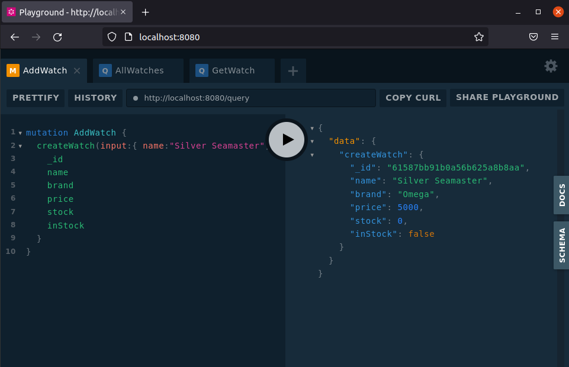
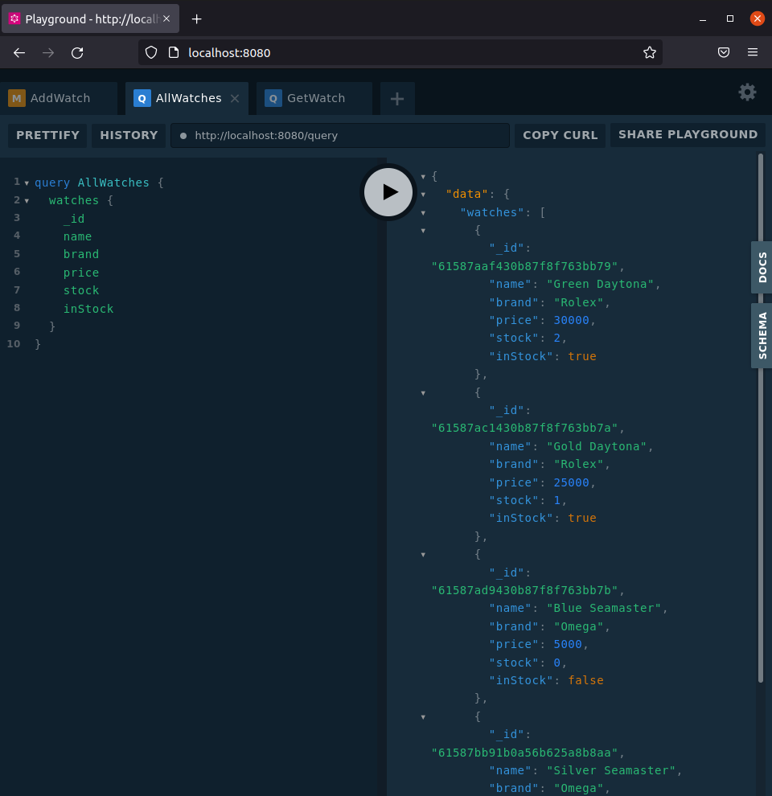
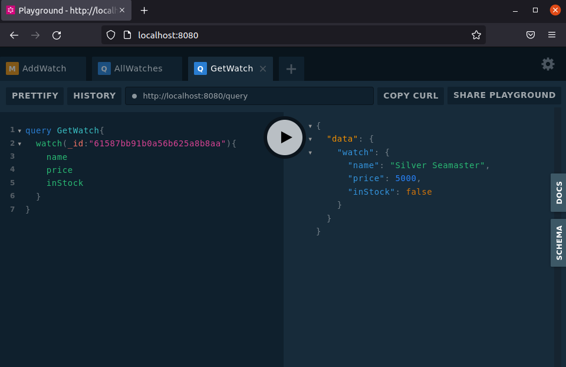
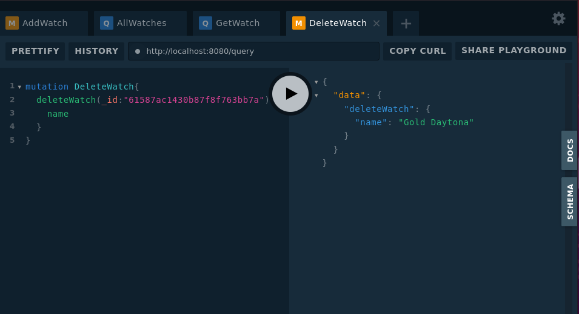
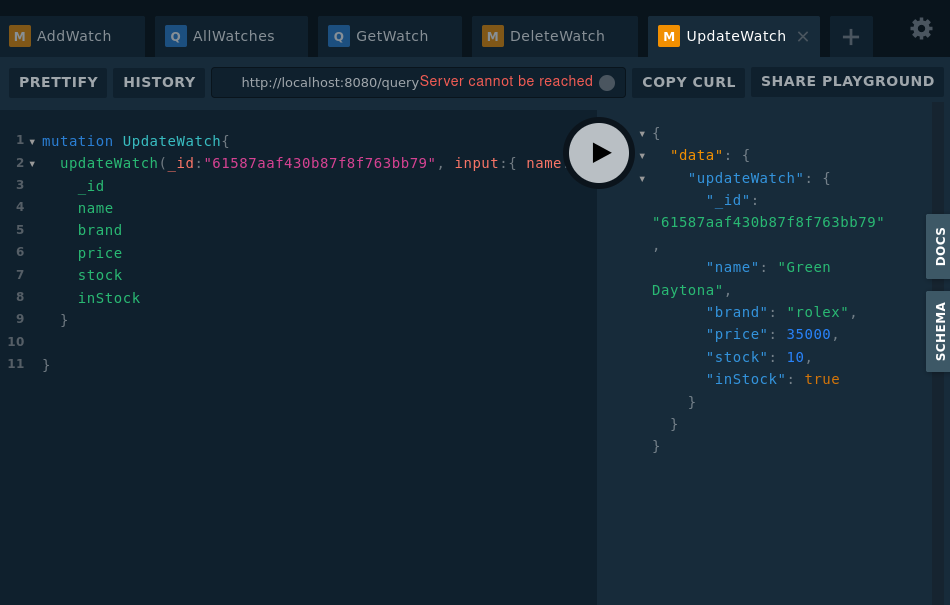

Simple GraphQL,Go and MongoDB example of a Watch Store

Mutation example for creating a watch:

Query example for getting ell watches

Query example for fetching watch by ID

Mutation example for deleting watch by ID

Mutation example for updating a watch by ID
